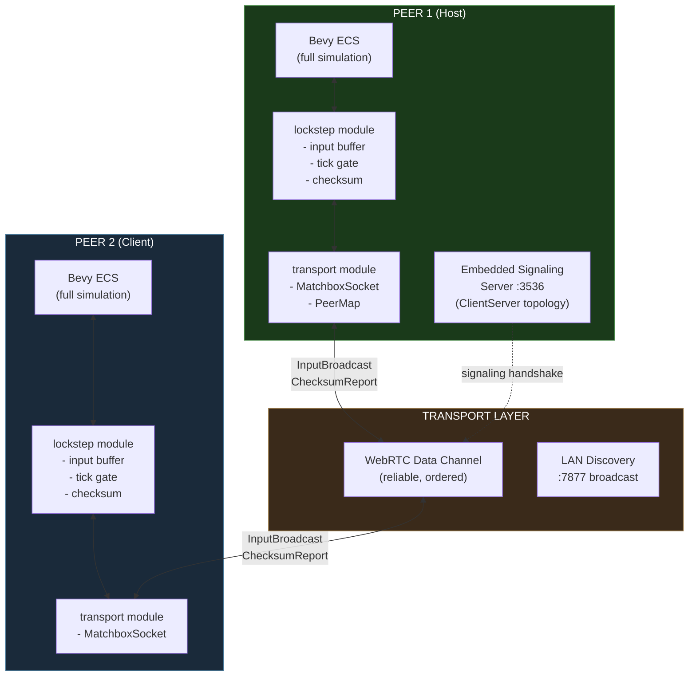
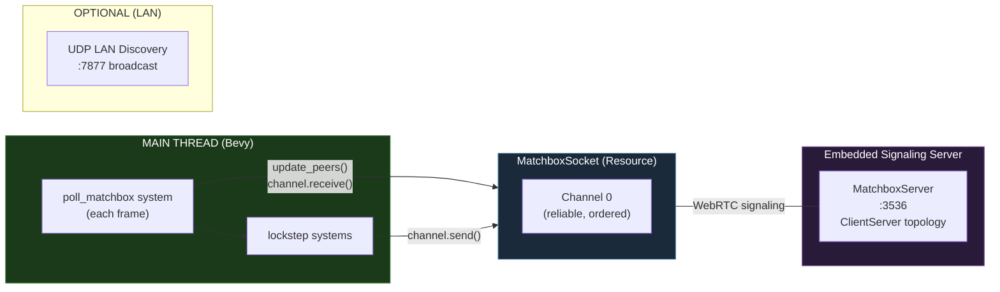
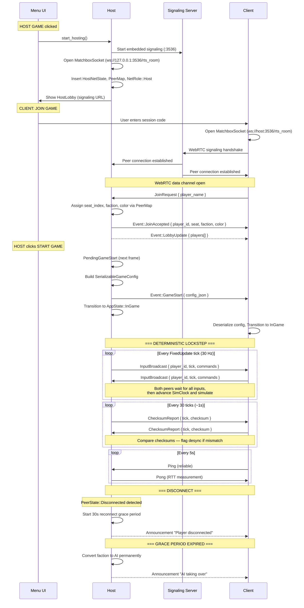
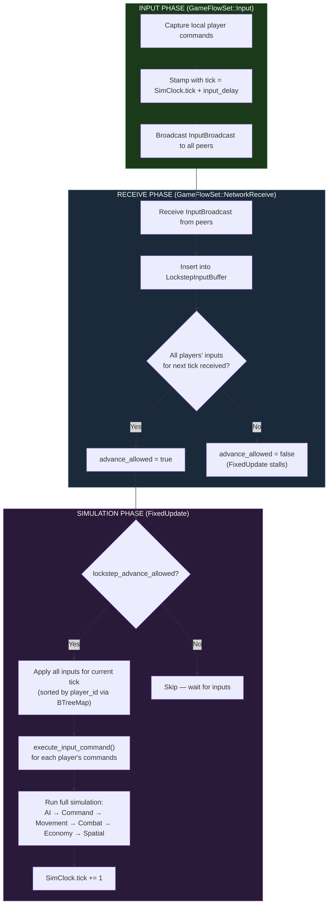
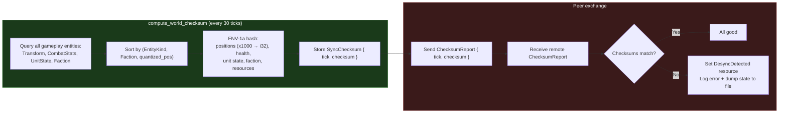
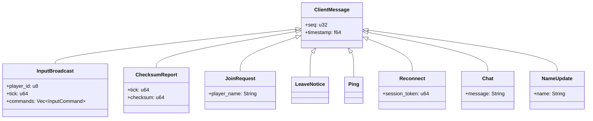
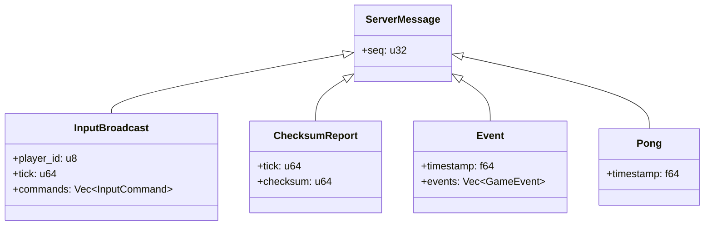
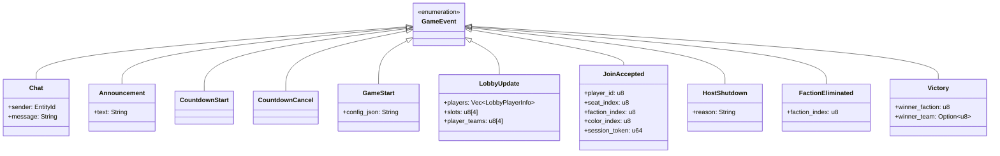
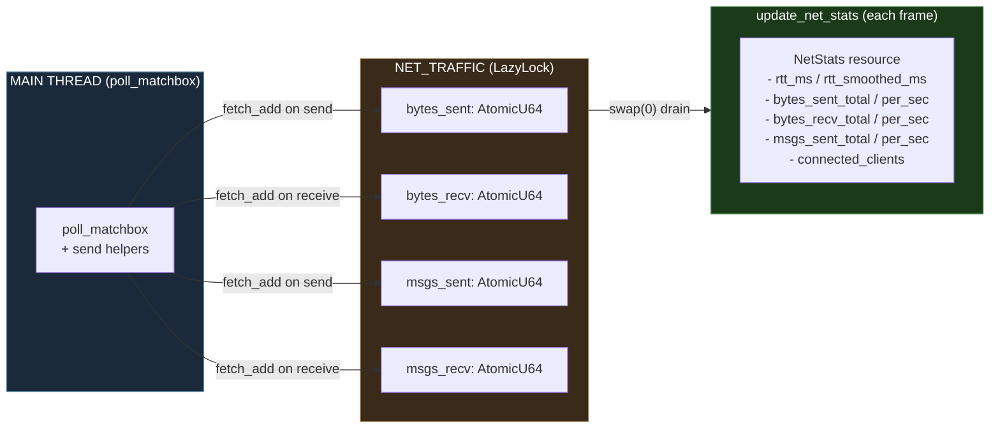
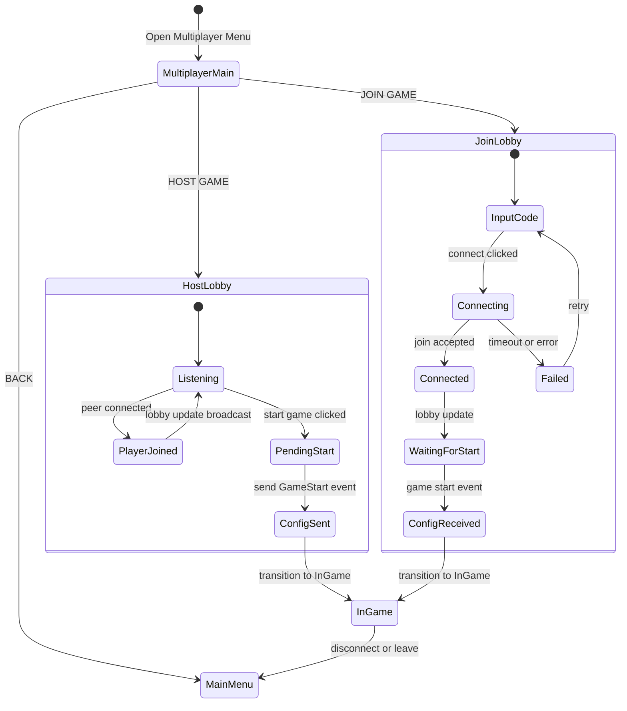

# Multiplayer Architecture

> **Deterministic lockstep** multiplayer with **Matchbox WebRTC** transport (native only).
> Embedded signaling server on the host — no external infrastructure needed for LAN play.
> WebRTC NAT traversal enables internet play without VPN.
> **MessagePack binary wire protocol** over reliable WebRTC data channel. All peers run the full simulation; only player inputs are exchanged.
> FNV-1a checksum-based desync detection every ~1 second.
> Reconnection with 30s grace period.

---

## System Topology



### Module split

All multiplayer modules live under `src/infrastructure/multiplayer/`:

- `lockstep`: `LockstepInputBuffer`, tick gate, input application — the core deterministic sync loop.
- `checksum`: `SyncChecksum`, `DesyncDetected`, FNV-1a world state hashing every 30 ticks.
- `transport` / `matchbox_transport`: Matchbox WebRTC wrapper, peer tracking, LAN discovery.
- `host_systems`: host-side lobby management, input relay to other peers.
- `client_systems`: client-side input capture, connection to host signaling.
- `server/`: host networking (join/leave handling, event broadcast).
- `client/`: client networking (message receive, ping).
- `debug_tap`: network debugging utilities.

The multiplayer menu UI lives under `src/ui/menu/multiplayer/`.

---

## Transport Architecture



- All I/O is polled from the main Bevy thread via `poll_matchbox`
- Native-only transport (WASM support removed)
- WebRTC NAT traversal via ICE/STUN for internet play
- Single reliable channel — no unreliable channel needed (no high-frequency state sync)
- Codec: MessagePack (`rmp-serde`)

---

## Connection Lifecycle



---

## Lockstep Synchronization



### LockstepInputBuffer

```rust
pub struct LockstepInputBuffer {
    pub pending: BTreeMap<u64, BTreeMap<u8, PlayerInput>>,
    pub confirmed_tick: u64,
    pub input_delay: u64,         // default: 3 ticks (~100ms at 30 Hz)
    pub expected_players: u8,
    pub advance_allowed: bool,
    pub last_applied_tick: Option<u64>,
    pub last_local_tick_sent: Option<u64>,
    seq: u32,
}
```

- `BTreeMap` ensures deterministic iteration order (sorted by tick, then by player_id)
- `input_delay` of 3 ticks at 30 Hz = ~100ms — enough to absorb typical LAN jitter
- Simulation stalls if any peer's input is missing for the next tick

### Determinism guarantees

| Concern | Solution |
|---------|----------|
| Frame-rate independence | All simulation in `FixedUpdate` at 30 Hz, using `Time<Fixed>` |
| System ordering | `GameFlowSet` chain: Input → NetworkReceive → Simulation → NetworkBroadcast; `SimSet` chain: Ai → Command → Movement → Combat → Economy → Spatial |
| RNG | `GameRng` resource: `StdRng` seeded from `map_seed`, with `fork(tag)` for subsystems |
| Collection iteration | `BTreeMap` in lockstep buffer and combat slot assignment; spatial queries sorted by Entity |
| Entity spawn order | Deterministic via `SimSet` ordering — same spawn sequence on all peers |
| Tick counter | `SimClock.tick` increments once per `FixedUpdate`, shared by all peers |

---

## Desync Detection



- Positions quantized to 1mm precision (multiply by 1000, cast to i32) before hashing
- Only gameplay state is hashed — visual state (animations, particles, interpolation) is excluded
- On desync: entity state dump written to `desync_dump_tick_{N}.txt` for manual diffing

---

## Message Protocol

### Wire Format

Messages are MessagePack-encoded bytes over a single reliable, ordered WebRTC data channel.

### Client → Host Messages



### Host → Client Messages



### Game Events (inside `Event` message)



---

## Network Bandwidth

| Data | Frequency | Channel | Size |
|------|-----------|---------|------|
| InputBroadcast (per player) | Every tick (30 Hz) | Reliable | ~20-200 bytes (depends on commands) |
| ChecksumReport | Every 30 ticks (~1 Hz) | Reliable | 16 bytes |
| Ping/Pong | Every 5s | Reliable | 8 bytes |
| Event (lobby/chat) | On demand | Reliable | Variable |

Lockstep bandwidth is minimal compared to the old state sync — typically <5 KB/s per peer.

---

## Network Statistics (`NetStats`)



**RTT calculation (client only):**
- Send `Ping { timestamp }` every 5s
- Host replies `Pong { timestamp }` (echo back)
- `rtt_ms = now - timestamp`
- `rtt_smoothed = 0.8 * old + 0.2 * new` (exponential moving average)

---

## Lobby & Session Management



**Session code format:** Signaling URL (e.g., `ws://192.168.1.5:3536/rts_room`) or just the host IP (auto-expanded to `ws://IP:3536/rts_room`)

**Player ID assignment:**
- Host: `player_id = 0`
- Clients: assigned incrementally (1, 2, 3, ...) via `PeerMap` when peers connect

---

## Peer Responsibility Split

| Responsibility | Host | Client |
|---------------|------|--------|
| World simulation (AI, combat, economy) | Full | Full (identical) |
| Entity spawning/despawning | Local (deterministic) | Local (deterministic) |
| Player input | Captures + broadcasts | Captures + broadcasts |
| Input relay to other clients | Relays peer inputs | N/A |
| AI opponents | Runs all AI logic | Runs all AI logic (identical) |
| Lobby management | Accept/reject, assign seats | Display only |
| Signaling server | Runs embedded on :3536 | Connects to host's signaling |
| Desync detection | Computes + exchanges checksums | Computes + exchanges checksums |
| Disconnect handling | Starts 30s grace period | Notified via announcement |

In lockstep, Host and Client are functionally identical for simulation purposes. The "Host" designation only controls lobby management and acts as the relay point for input distribution.
