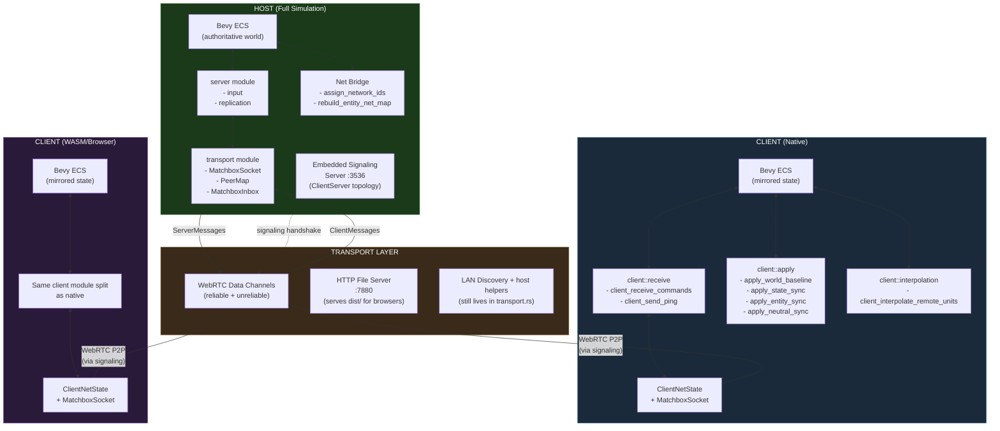
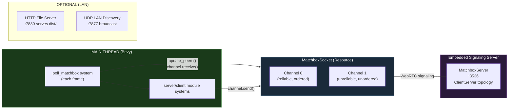
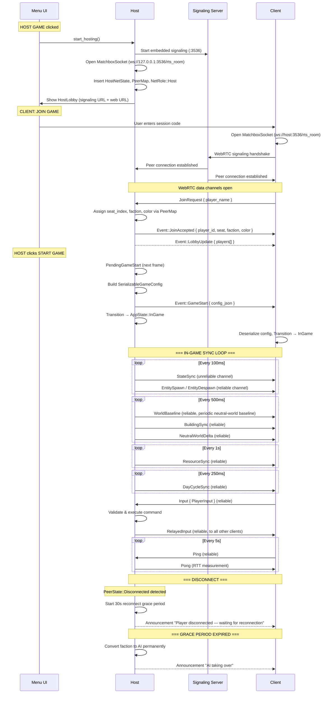
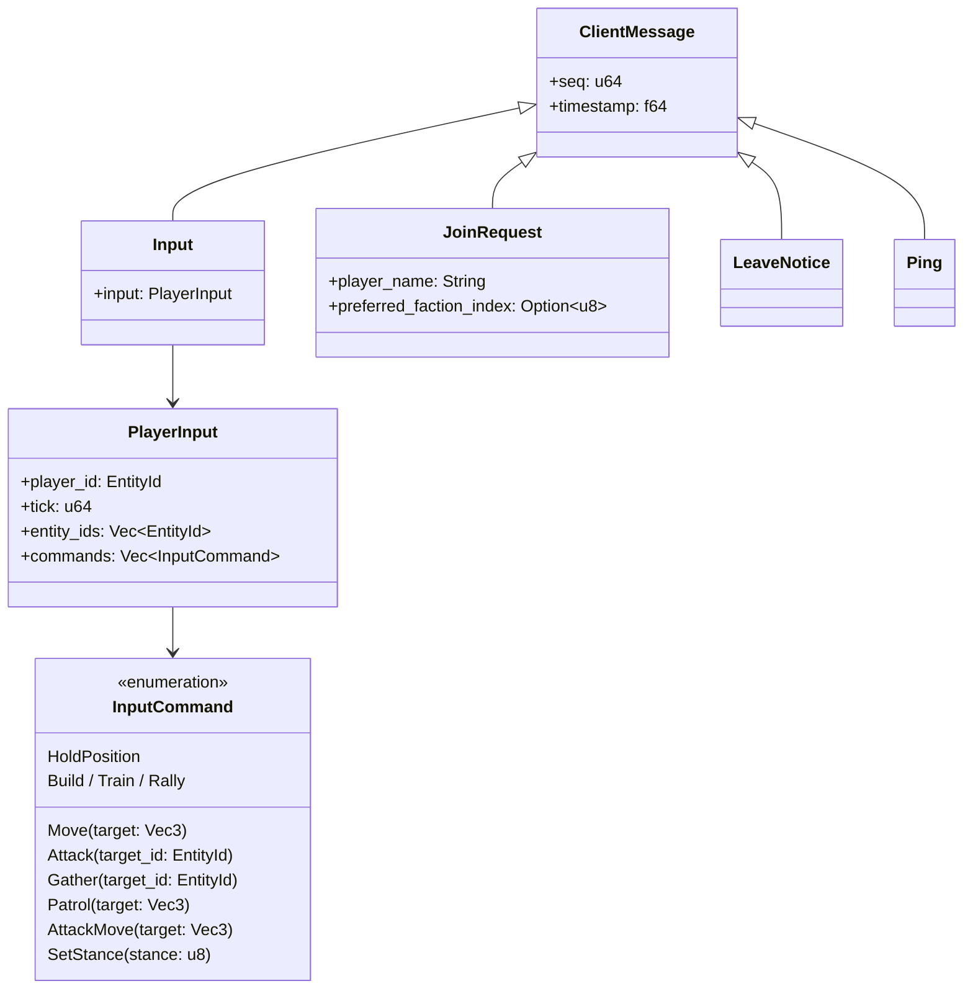
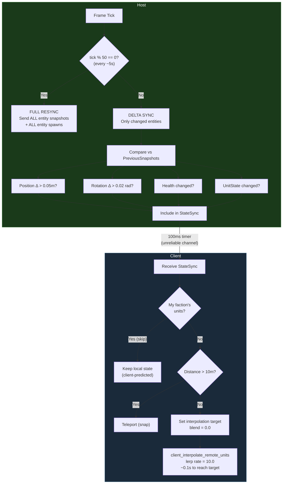
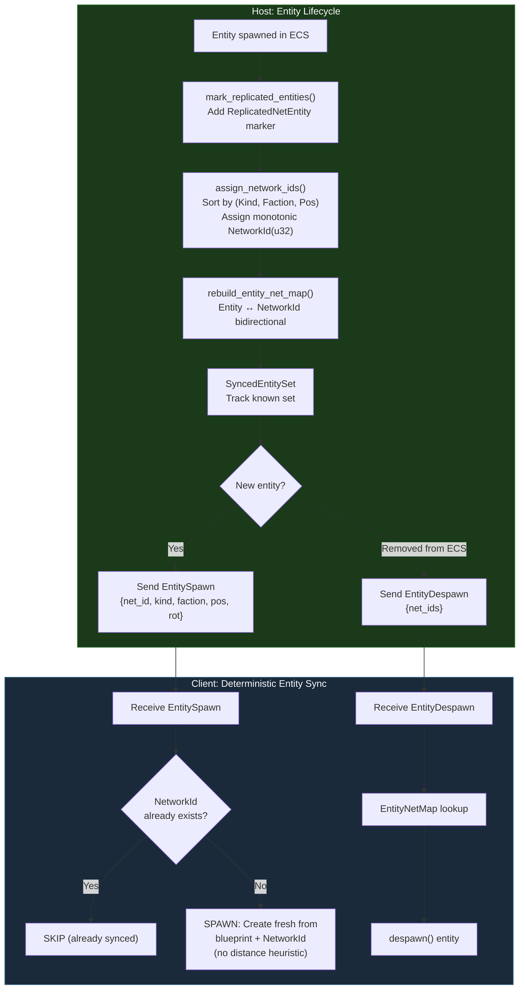
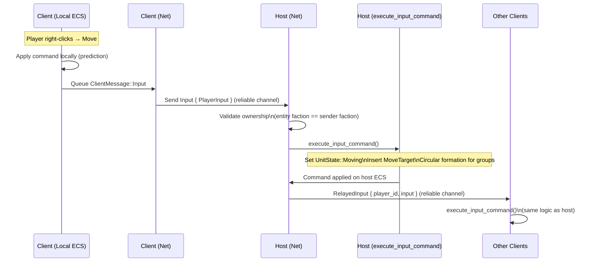
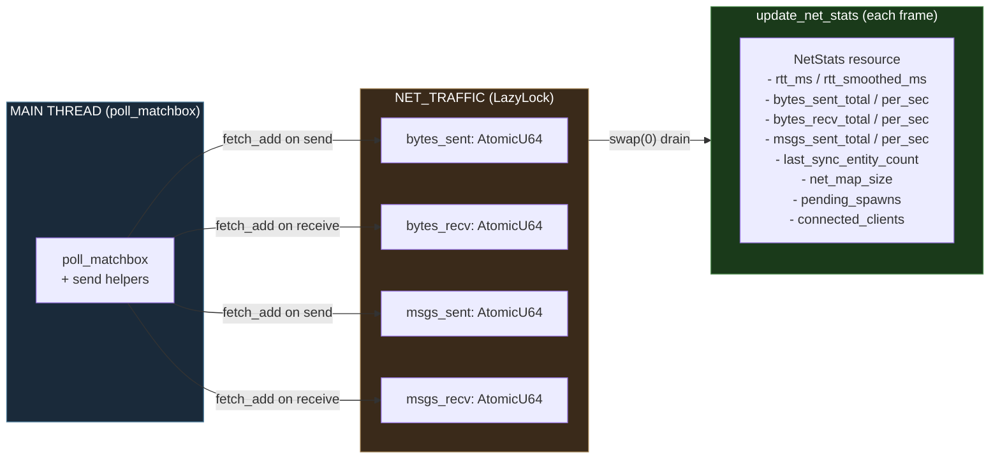
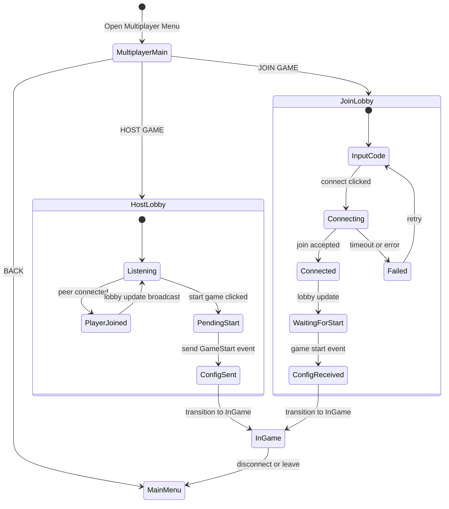

# Multiplayer Architecture

> Host-authoritative multiplayer with **Matchbox WebRTC** transport (native + WASM).
> Embedded signaling server on the host — no external infrastructure needed for LAN play.
> WebRTC NAT traversal enables internet play without VPN.
> **MessagePack binary wire protocol** over reliable + unreliable WebRTC data channels. Delta-compressed state sync at ~10Hz with staged client application.
> Reconnection with 30s grace period.

---

## System Topology

### Current module split

- `transport`: Matchbox send/receive path, peer tracking, LAN discovery, and HTTP hosting helpers.
- `server::input`: host-side command validation/execution and disconnect handling.
- `server::replication`: host-side snapshot building and broadcast systems.
- `client::receive`: drains inbox and stages server messages into pending resources.
- `client::apply`: mutates ECS from staged baseline/delta data.
- `client::interpolation`: visual smoothing only.

---

## Transport Architecture

**Key differences from the old TCP/WS architecture:**
- No background reader/writer threads — all I/O is polled from the main Bevy thread via `poll_matchbox` system
- Unified transport for native and WASM — no `#[cfg(target_arch)]` branching in connection code
- WebRTC NAT traversal via ICE/STUN — internet play without VPN
- Two channels: reliable (commands, events, spawns) and unreliable (high-frequency state sync)
- `transport.rs` still contains legacy LAN discovery / HTTP host helpers, so the file is broader than just Matchbox runtime transport

---

## Connection Lifecycle

### Client apply pipeline

The in-game client path is now two-stage:

1. `client_receive_commands` drains `MatchboxInbox` and stores incoming data in pending resources.
2. Follow-up apply systems mutate ECS in deterministic order:
   - `client_apply_world_baseline`
   - `client_apply_relayed_inputs`
   - `client_apply_state_sync`
   - `client_apply_building_sync`
   - `client_apply_resource_sync`
   - `client_apply_day_cycle_sync`
   - `client_apply_server_events`
   - `client_apply_entity_sync`
   - `client_apply_neutral_sync`
3. `client_interpolate_remote_units` performs visual smoothing after authoritative state is staged.

---

## Message Protocol

### Wire Format

Messages are sent as MessagePack-encoded bytes directly over WebRTC data channels (no length-prefix framing needed — WebRTC is message-oriented).

- **Channel 0 (reliable, ordered):** Commands, events, entity spawns/despawns, building sync, resource sync, day cycle sync
- **Channel 1 (unreliable, unordered):** High-frequency `StateSync` with entity positions (falls back to reliable if payload > 16KB)
- **Codec:** MessagePack (`rmp-serde`) — ~2-4x smaller than JSON, self-describing binary format

### Client → Server Messages

### Server → Client Messages

```mermaid
classDiagram
    class ServerMessage {
        +seq: u64
    }

    class StateSync {
        +entities: Vec~EntitySnapshot~
    }
    class EntitySpawn {
        +spawns: Vec~EntitySpawnData~
    }
    class EntityDespawn {
        +net_ids: Vec~EntityId~
    }
    class BuildingSync {
        +buildings: Vec~BuildingSnapshot~
    }
    class ResourceSync {
        +factions: Vec~(u8, u32[10])~
    }
    class DayCycleSync {
        +cycle: DayCycleSnapshot
    }
    class RelayedInput {
        +player_id: u8
        +input: PlayerInput
    }
    class Event {
        +timestamp: f64
        +events: Vec~GameEvent~
    }
    class NeutralWorldDelta {
        +objects: Vec~NeutralWorldSnapshot~
    }
    class WorldBaseline {
        +terrain: TerrainDescriptor
        +neutral_objects: Vec~NeutralWorldSnapshot~
    }
    class Pong {
        +timestamp: f64
    }

    ServerMessage <|-- StateSync
    ServerMessage <|-- EntitySpawn
    ServerMessage <|-- EntityDespawn
    ServerMessage <|-- BuildingSync
    ServerMessage <|-- ResourceSync
    ServerMessage <|-- DayCycleSync
    ServerMessage <|-- NeutralWorldDelta
    ServerMessage <|-- WorldBaseline
    ServerMessage <|-- RelayedInput
    ServerMessage <|-- Event
    ServerMessage <|-- Pong
```

### Game Events (inside `Event` message)

---

## State Sync Strategy

### Baseline vs delta

- `StateSync`, `EntitySpawn`, `EntityDespawn`, `BuildingSync`, `ResourceSync`, `DayCycleSync`, and `NeutralWorldDelta` remain the main runtime delta path.
- `WorldBaseline` is now actively emitted by the host and applied by clients, but it currently covers:
  - terrain metadata (`TerrainDescriptor`)
  - neutral world objects
- `WorldBaseline` does **not** yet replace entity bootstrap. Faction/unit/building entity bootstrap still depends on `EntitySpawn` plus periodic full resync behavior.
- Practically, the baseline path is now a neutral-world bootstrap/resync path, not a full-world snapshot path.

---

## Entity Replication

**Replicated entity types:** `EntityKind`, `ResourceNode`, `Sapling`, `GrowingTree`, `GrowingResource`, `MatureTree`, `ExplosiveProp`

---

## Command Flow (Player Input)

---

## Sync Cadence Table

| Data Type | Interval | System | Channel | Delta Compressed |
|-----------|----------|--------|---------|-----------------|
| Entity positions, health, state | 100ms (~10Hz) | `host_broadcast_state_sync` | Unreliable | Yes (Δ pos>0.05, rot>0.02) |
| Entity spawns/despawns | 100ms | `host_broadcast_entity_spawns` | Reliable | Yes (new/removed only) |
| Building state | 500ms | `host_broadcast_building_sync` | Reliable | Yes (level/progress/queue Δ) |
| Neutral-world baseline | first tick, then periodic (~5s via 500ms timer * 10) | `host_broadcast_neutral_world_sync` | Reliable | No (full neutral snapshot) |
| Resource node amounts | 500ms (~2Hz) | `host_broadcast_neutral_world_sync` | Reliable | Yes (amount_remaining Δ) |
| Player resources | 1000ms | `host_broadcast_resource_sync` | Reliable | No (full) |
| Day/night cycle | 250ms | `host_broadcast_day_cycle_sync` | Reliable | No (full) |
| Full resync (all data) | ~5s (tick%50) | Same systems | Both | No (forced full) |
| Ping/Pong (keepalive) | 5s | `client_send_ping` | Reliable | N/A |

---

## Network Statistics (`NetStats`)

**RTT calculation (client only):**
- Send `Ping { timestamp }` every 5s
- Host replies `Pong { timestamp }` (echo back)
- `rtt_ms = now - timestamp`
- `rtt_smoothed = 0.8 * old + 0.2 * new` (exponential moving average)

---

## Lobby & Session Management

**Session code format:** Signaling URL (e.g., `ws://192.168.1.5:3536/rts_room`) or just the host IP (auto-expanded to `ws://IP:3536/rts_room`)

**Web client access:** The host serves the WASM build at `http://<host-ip>:7880` when a `dist/` directory is present. Browser players open that URL, then enter the session code to join.

**Player ID assignment:**
- Host: `player_id = 0`
- Clients: assigned incrementally (1, 2, 3, ...) via `PeerMap` when peers connect

---

## Host/Client Responsibility Split

| Responsibility | Host | Client |
|---------------|------|--------|
| World simulation (physics, AI, combat) | Authoritative | Read-only mirror |
| Entity spawn/despawn | Creates + broadcasts | Receives + spawns locally |
| NetworkId assignment | Assigns (sorted, monotonic) to entities + neutral objects | Receives via EntitySpawn / NeutralWorldDelta |
| Player commands | Validates + executes + relays | Sends input, applies relayed |
| Resource tracking (player totals) | Authoritative | Synced every 1s |
| Resource node amounts (world) | Authoritative | Synced every 500ms (NeutralWorldDelta) |
| Building construction/training | Runs timers + logic | Synced every 500ms |
| Day/night cycle | Runs timer | Synced every 250ms |
| AI opponents | Runs all AI logic | No AI systems (cleared) |
| Lobby management | Accept/reject, assign seats | Display only |
| Signaling server | Runs embedded on :3536 | Connects to host's signaling |

---

## Known Limitations

- **No rollback/prediction:** Client commands are fire-and-forget; no reconciliation if host rejects
- **WorldBaseline is partial:** It is now wired, but only for terrain metadata + neutral world objects; full entity/bootstrap state still depends on `EntitySpawn` plus periodic full resync behavior
- **Max 4 players** (hardcoded faction count)
- **Reconnection is partial:** Grace period and session tokens work host-side, but the client-side reconnect UI flow (auto-retry + `Reconnect` message) is not yet wired
- **No TURN relay:** WebRTC STUN works for most NATs, but symmetric NAT requires a TURN server (not yet configured)

---

## Known Remaining Work

- **TURN relay**: Configure a TURN server for symmetric NAT traversal (currently STUN-only)
- **Message batching**: Wire `PendingServerFrame` to batch all host broadcast systems into a single `ServerFrame` per tick (`ServerFrame` type and `PendingServerFrame` resource exist but aren't used yet)
- **Client prediction**: Prediction buffer + server seq stamping + reconciliation loop (currently fire-and-forget, 1 RTT visual delay)
- **Reconnect UI**: Client-side auto-retry flow (detect disconnect → reconnect with `Reconnect { session_token }`) — host-side grace period + tokens are done
- **Full baseline coverage**: Extend `WorldBaseline` or add a true full-world bootstrap message for entity/unit/building state on late join and reconnect
- **Standalone signaling server**: For production internet play, extract signaling into a deployable binary

---

## Source Files

| File | Purpose |
|------|---------|
| `src/multiplayer/mod.rs` | Plugin wiring, shared resources, run conditions, NetStats, SessionTokens |
| `src/multiplayer/transport.rs` | Matchbox transport re-exports plus LAN discovery (UDP :7877), HTTP file server (:7880), IP detection, and legacy transport helpers |
| `src/multiplayer/server/input.rs` | Server-side input/command handling re-exports |
| `src/multiplayer/server/replication.rs` | Server-side replication/broadcast re-exports |
| `src/multiplayer/host_systems.rs` | Host command execution, snapshot building, delta sync, neutral baseline/delta emission, reconnect grace |
| `src/multiplayer/client/receive.rs` | Client receive/staging re-exports |
| `src/multiplayer/client/apply.rs` | Client apply-system re-exports |
| `src/multiplayer/client/interpolation.rs` | Client interpolation re-exports |
| `src/multiplayer/client_systems.rs` | Staged client receive/apply implementation, interpolation, neutral world apply |
| `src/multiplayer/debug_tap.rs` | HTTP debug server, TX/RX event recording |
| `src/net_bridge.rs` | NetworkId assignment (entities + neutral objects), EntityNetMap |
| `src/menu/multiplayer.rs` | Lobby UI, connection flow (start_hosting, connect_to_host_system, update_lobby_ui), config serialization |
| `game_state/src/message.rs` | All network message types + ServerFrame |
| `game_state/src/codec.rs` | MessagePack encode/decode helpers |
