# Multiplayer Architecture

> Host-authoritative LAN multiplayer with TCP (native) and WebSocket (WASM) transport.
> Same-origin hosted-session routing has been added for the deployed web client via a native `session_router`.
> **MessagePack binary wire protocol** with 4-byte length-prefixed framing. Delta-compressed state sync at ~10Hz.
> JSON fallback for legacy clients. Numeric entity/faction discriminants. Reconnection with 30s grace period.

---

## System Topology

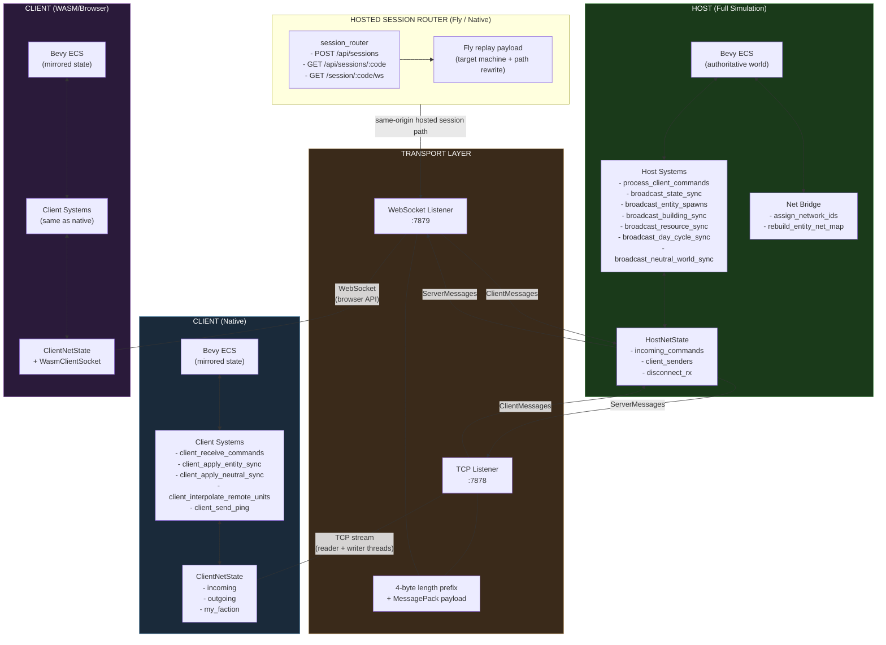

---

## Thread Architecture (Host)

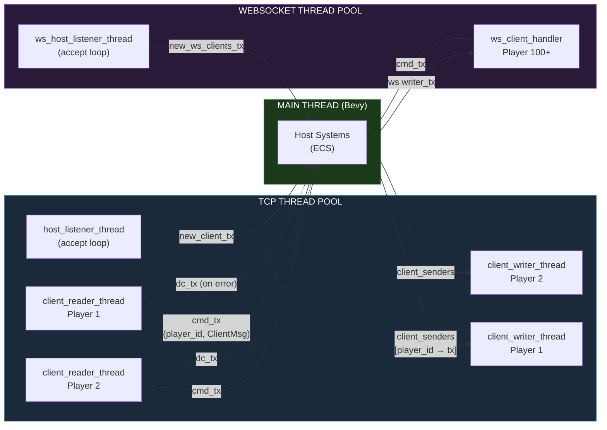

---

## Connection Lifecycle

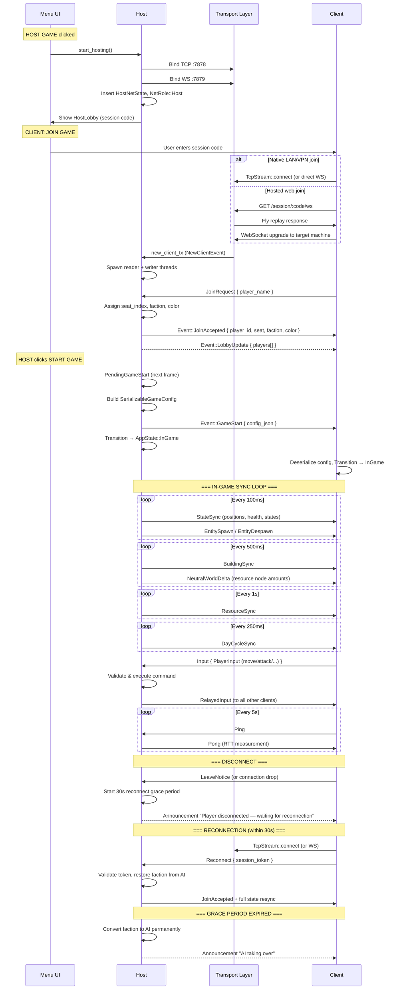

---

## Message Protocol

### Wire Format

```
┌──────────────────┬──────────────────────────┐
│  4 bytes (BE)    │  N bytes                 │
│  payload length  │  MessagePack payload     │
└──────────────────┴──────────────────────────┘
```

- **Codec**: MessagePack (rmp-serde) — ~2-4x smaller than JSON, self-describing binary format
- **Fallback**: Reader threads try MessagePack first, then JSON for legacy clients
- **WebSocket**: Binary frames (MessagePack), with Text frame fallback (JSON)
- TCP keepalive: 15s interval, 10s timeout
- Read timeout: 2s per recv attempt

### Client → Server Messages

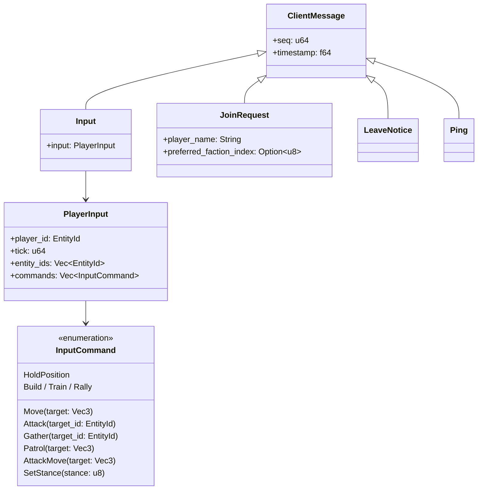

### Server → Client Messages

```mermaid
classDiagram
    class ServerMessage {
        +seq: u64
    }

    class StateSync {
        +entities: Vec~EntitySnapshot~
    }
    class EntitySpawn {
        +spawns: Vec~EntitySpawnData~
    }
    class EntityDespawn {
        +net_ids: Vec~EntityId~
    }
    class BuildingSync {
        +buildings: Vec~BuildingSnapshot~
    }
    class ResourceSync {
        +factions: Vec~(u8, u32[10])~
    }
    class DayCycleSync {
        +cycle: DayCycleSnapshot
    }
    class RelayedInput {
        +player_id: u8
        +input: PlayerInput
    }
    class Event {
        +timestamp: f64
        +events: Vec~GameEvent~
    }
    class NeutralWorldDelta {
        +objects: Vec~NeutralWorldSnapshot~
    }
    class Pong {
        +timestamp: f64
    }

    ServerMessage <|-- StateSync
    ServerMessage <|-- EntitySpawn
    ServerMessage <|-- EntityDespawn
    ServerMessage <|-- BuildingSync
    ServerMessage <|-- ResourceSync
    ServerMessage <|-- DayCycleSync
    ServerMessage <|-- NeutralWorldDelta
    ServerMessage <|-- RelayedInput
    ServerMessage <|-- Event
    ServerMessage <|-- Pong
```

### Game Events (inside `Event` message)

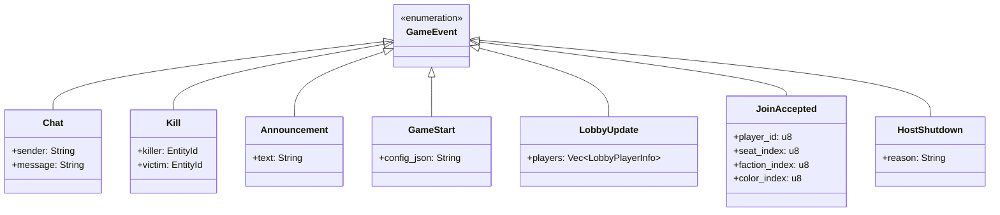

---

## State Sync Strategy

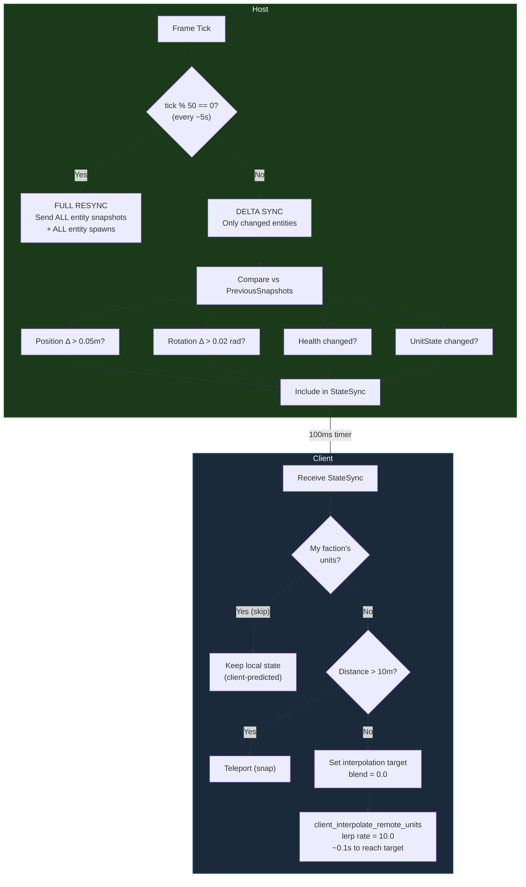

---

## Entity Replication

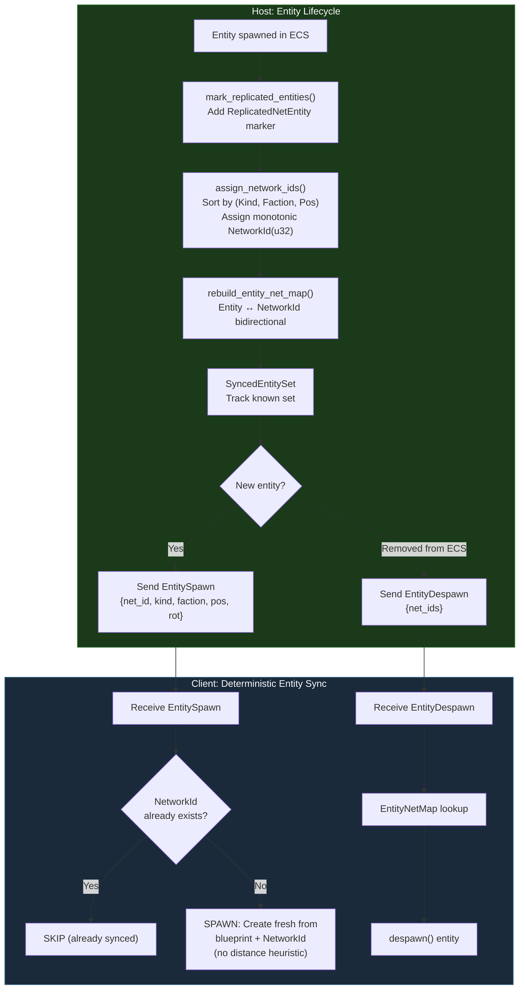

**Replicated entity types:** `EntityKind`, `ResourceNode`, `Sapling`, `GrowingTree`, `GrowingResource`, `MatureTree`, `ExplosiveProp`

---

## Command Flow (Player Input)

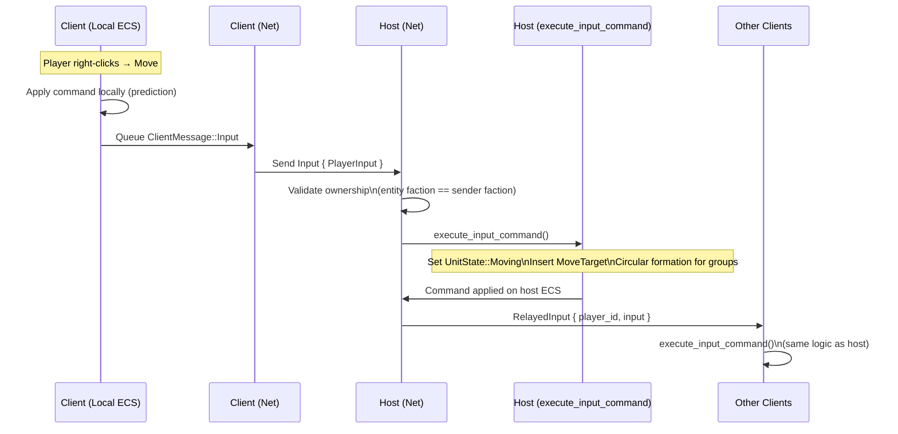

---

## Sync Cadence Table

| Data Type | Interval | System | Delta Compressed |
|-----------|----------|--------|-----------------|
| Entity positions, health, state | 100ms (~10Hz) | `host_broadcast_state_sync` | Yes (Δ pos>0.05, rot>0.02) |
| Entity spawns/despawns | 100ms | `host_broadcast_entity_spawns` | Yes (new/removed only) |
| Building state | 500ms | `host_broadcast_building_sync` | Yes (level/progress/queue Δ) |
| Resource node amounts | 500ms (~2Hz) | `host_broadcast_neutral_world_sync` | Yes (amount_remaining Δ) |
| Player resources | 1000ms | `host_broadcast_resource_sync` | No (full) |
| Day/night cycle | 250ms | `host_broadcast_day_cycle_sync` | No (full) |
| Full resync (all data) | ~5s (tick%50) | Same systems | No (forced full) |
| Ping/Pong (keepalive) | 5s | `client_send_ping` | N/A |

---

## Network Statistics (`NetStats`)

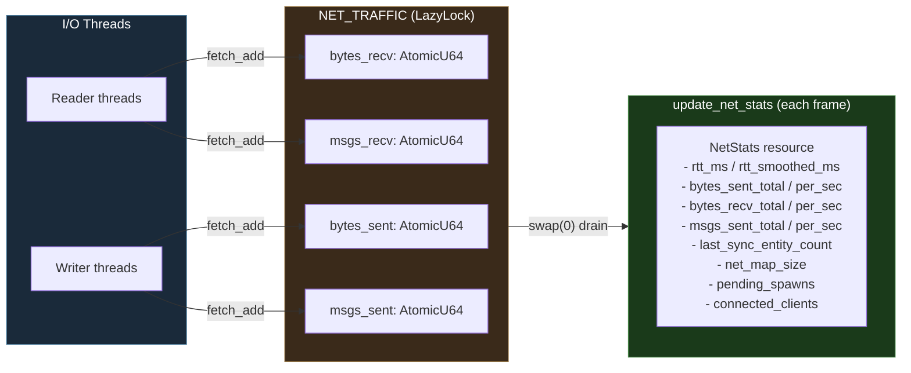

**RTT calculation (client only):**
- Send `Ping { timestamp }` every 5s
- Host replies `Pong { timestamp }` (echo back)
- `rtt_ms = now - timestamp`
- `rtt_smoothed = 0.8 * old + 0.2 * new` (exponential moving average)

---

## Lobby & Session Management

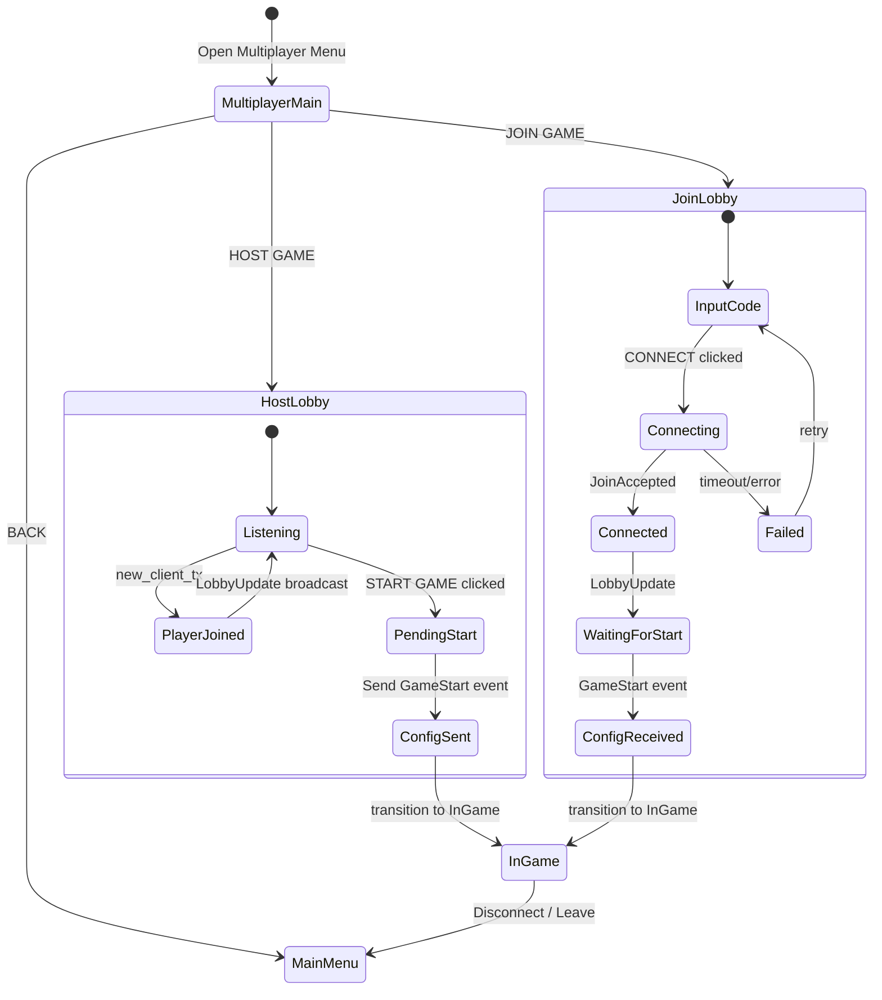

**Session code formats:**
- Native LAN/VPN: `IP:PORT` (e.g. `192.168.1.5:7878`)
- Hosted web path: opaque session code resolved on the same origin as `/session/<code>/ws`

**Player ID assignment:**
- Host: `player_id = 0`
- TCP clients: `1, 2, 3, ...`
- WebSocket clients: `100, 101, 102, ...` (avoids collision)

---

## Host/Client Responsibility Split

| Responsibility | Host | Client |
|---------------|------|--------|
| World simulation (physics, AI, combat) | Authoritative | Read-only mirror |
| Entity spawn/despawn | Creates + broadcasts | Receives + spawns locally |
| NetworkId assignment | Assigns (sorted, monotonic) to entities + neutral objects | Receives via EntitySpawn / NeutralWorldDelta |
| Player commands | Validates + executes + relays | Sends input, applies relayed |
| Resource tracking (player totals) | Authoritative | Synced every 1s |
| Resource node amounts (world) | Authoritative | Synced every 500ms (NeutralWorldDelta) |
| Building construction/training | Runs timers + logic | Synced every 500ms |
| Day/night cycle | Runs timer | Synced every 250ms |
| AI opponents | Runs all AI logic | No AI systems (cleared) |
| Lobby management | Accept/reject, assign seats | Display only |

---

## Known Limitations

- **No rollback/prediction:** Client commands are fire-and-forget; no reconciliation if host rejects
- **WorldBaseline:** Message type defined but not yet wired (needed for late joiners / reconnect full resync)
- **No NAT traversal:** LAN/VPN only (no STUN/TURN)
- **Max 4 players** (hardcoded faction count)
- **Reconnection is partial:** Grace period and session tokens work host-side, but the client-side reconnect UI flow (auto-retry + `Reconnect` message) is not yet wired
- **Hosted-session routing is partial:** The router and same-origin path exist, but session-host registration and replay-to-live-machine bootstrapping are not wired into the host flow yet

---

## Known Remaining Work

- **Hosted session registration**: Generate opaque codes and register live host machines with `POST /api/sessions`
- **Fly machine targeting**: Populate router registrations with real `app`, `machine_id`, `region`, and target WS path metadata
- **Host bootstrap**: Run a real session host process that exposes the replay target WebSocket endpoint (currently expected to be `/ws`)
- **Message batching**: Wire `PendingServerFrame` to batch all host broadcast systems into a single `ServerFrame` per tick (`ServerFrame` type and `PendingServerFrame` resource exist but aren't used yet)
- **Client prediction**: Prediction buffer + server seq stamping + reconciliation loop (currently fire-and-forget, 1 RTT visual delay)
- **Reconnect UI**: Client-side auto-retry flow (detect disconnect → reconnect with `Reconnect { session_token }`) — host-side grace period + tokens are done
- **WorldBaseline wiring**: Send full entity + neutral world state to newly connected/reconnected clients
- **Optional**: LZ4 compression for large frames, `crossbeam-channel` migration, Bevy observers for connect/disconnect events

---

## Source Files

| File | Purpose | Lines |
|------|---------|-------|
| `src/multiplayer/mod.rs` | Plugin, resources, system sets, NetStats, SessionTokens | ~780 |
| `src/multiplayer/transport.rs` | TCP/WS framing, threads, IP detection, msgpack codec | ~780 |
| `src/multiplayer/host_systems.rs` | Host broadcast, command execution, delta sync, neutral world sync, reconnect grace | ~1590 |
| `src/multiplayer/client_systems.rs` | Client receive, interpolation, deterministic entity sync, neutral world apply | ~900 |
| `src/multiplayer/debug_tap.rs` | HTTP debug server, TX/RX event recording | ~300 |
| `src/multiplayer/ggrs_matchbox.rs` | GGRS rollback scaffolding (unused) | ~50 |
| `src/session_router.rs` | Hosted-session registry, route shape, Fly replay payload model | ~200 |
| `src/bin/session_router.rs` | Native HTTP router serving `dist/` plus hosted-session endpoints | ~240 |
| `src/net_bridge.rs` | NetworkId assignment (entities + neutral objects), EntityNetMap | ~220 |
| `src/menu/multiplayer.rs` | Lobby UI, connection flow, config serialization | ~1250 |
| `game_state/src/message.rs` | All network message types + ServerFrame | ~520 |
| `game_state/src/codec.rs` | MessagePack encode/decode helpers | ~25 |
